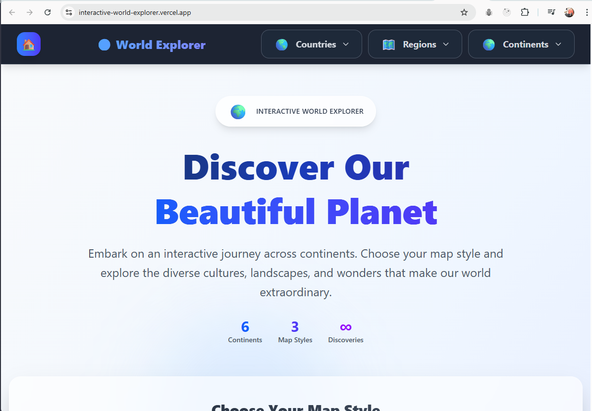
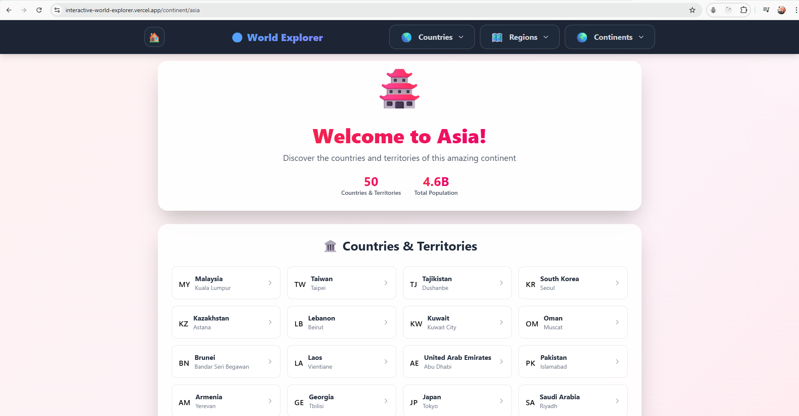
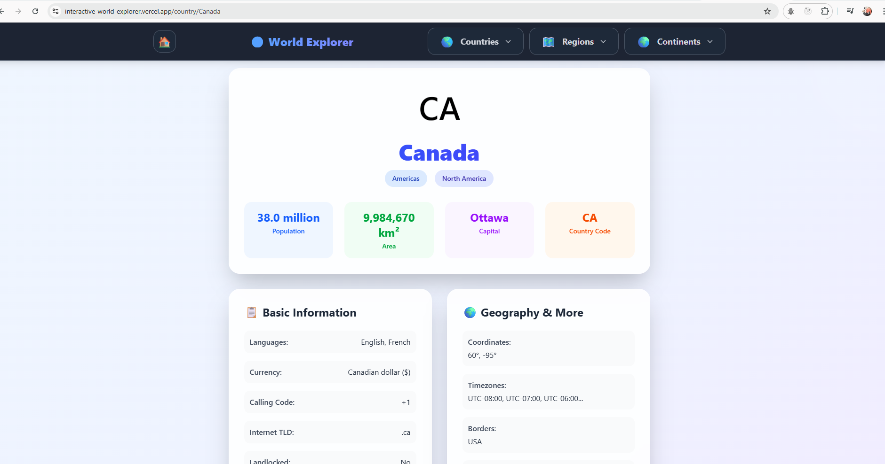

# 🌍 Interactive World Explorer


A modern, interactive world map application built with Next.js and TypeScript that allows users to explore continents and discover detailed information about countries around the globe.

## 📸 Screenshots

**Home Page**



**Continent View**



**Country View**



## ✨ Features

- **Interactive World Map** - Click on continents to explore countries
- **Multiple Map Styles** - Choose from 3 different map visualizations
- **Real-time Country Data** - Fetches live data from REST Countries API
- **Comprehensive Navigation** - Search countries, explore regions and continents
- **Detailed Country Information** - View population, area, languages, currencies, flags, and more
- **Responsive Design** - Works seamlessly on desktop and mobile devices
- **Dark Theme Navigation** - Professional dark-themed navbar and footer
- **SEO Optimized** - Dynamic metadata generation for all pages
- **Performance Optimized** - Static generation and image optimization
- **External Maps Integration** - Google Maps and OpenStreetMap links

## 🚀 Live Demo

[View Live Demo](https://interactive-world-explorer.vercel.app/)

## 🛠️ Tech Stack

- **Framework:** Next.js 14 with App Router
- **Language:** TypeScript
- **Styling:** Tailwind CSS
- **API:** REST Countries API
- **State Management:** React hooks + localStorage
- **Image Optimization:** Next.js Image component
- **Deployment:** Vercel (recommended)

## 📦 Installation

1. **Clone the repository:**

```bash
git clone https://github.com/yourusername/interactive-world-explorer.git
cd interactive-world-explorer

```

2. **Install dependencies:**

```bash
npm install
```

3. **Run the development server:**

```bash
npm run dev
```

4. **Open your browser:
   Navigate to http://localhost:3000**

## 📁 Project Structure

```bash
interactive-world-explorer/
├── app/
│ ├── components/
│ │ ├── navbar/
│ │ │ ├── Navbar.tsx # Main navigation component
│ │ │ ├── HomeIcon.tsx # Home button with active state
│ │ │ ├── CountriesDropdown.tsx # Searchable countries dropdown
│ │ │ ├── RegionsDropdown.tsx # Sub-regions navigation dropdown
│ │ │ └── ContinentsDropdown.tsx # Continents navigation dropdown
│ │ ├── CountryMapButtons.tsx # Interactive map buttons (client component)
│ │ ├── MapSelector.tsx # Map style selection component
│ │ ├── Map.tsx # Interactive world map component
│ │ └── Footer.tsx # Simple footer with copyright
│ ├── continent/[name]/
│ │ └── page.tsx # Dynamic continent pages
│ ├── country/[name]/
│ │ └── page.tsx # Dynamic country detail pages
│ ├── region/[name]/
│ │ └── page.tsx # Dynamic region pages
│ ├── lib/ (or api/)
│ │ ├── getContinentCountries.ts # Fetch countries by continent/region
│ │ ├── getRegionCountries.ts # Fetch countries by sub-region
│ │ └── getCountry.ts # Fetch individual country data
│ ├── globals.css # Global styles and Tailwind CSS
│ ├── layout.tsx # Root layout with navbar and footer
│ ├── page.tsx # Home page with interactive map
│ └── sitemap.ts # SEO sitemap generation
├── public/
│ └── images/ # Map images and assets
├── .gitignore # Git ignore file
├── next.config.js # Next.js configuration
├── package.json # Dependencies and scripts
├── tailwind.config.js # Tailwind CSS configuration
├── tsconfig.json # TypeScript configuration
├── types.d.ts # Types file
└── README.md # This file
```

## 🧩 Component Breakdown

### Core Components

#### `app/page.tsx` - Home Page

- **Purpose**: Main landing page with interactive world map
- **State Management**:
  - `selectedMap`: Current map style (stored in localStorage)
  - `isLoaded`: Loading state for map preferences
- **Features**:
  - Map style selection
  - Continent exploration
  - Persistent user preferences
- **Key Functions**:
  - `handleMapSelect()`: Updates map selection and saves to localStorage
  - `useEffect()`: Loads saved map preference on component mount

#### `app/components/Map.tsx` - Interactive Map

- **Purpose**: Main interactive world map with clickable continents
- **State Management**:
  - `hoveredContinent`: Currently hovered continent
  - `showInfo`: Selected continent for info display
  - `countries`: Fetched country data
  - `loading`: API loading state
  - `error`: Error handling state
- **Features**:
  - Hover effects
  - Continent selection
  - Country data fetching
  - Responsive design
- **Key Functions**:
  - `handleContinentClick()`: Processes continent clicks and fetches data
  - `getContinentStyling()`: Returns continent-specific colors and styling
  - `formatPopulation()` & `formatArea()`: Data formatting utilities

#### `app/components/MapSelector.tsx` - Map Style Selector

- **Purpose**: Allows users to choose between different map visualizations
- **State Management**:
  - `isOpen`: Dropdown open/close state
- **Features**:
  - 3 map style options
  - Preview thumbnails
  - Persistent selection
- **Map Options**:
  - Classic World Map
  - Detailed Countries Map
  - Vibrant Countries Map

### Navigation Components

#### `app/components/navbar/Navbar.tsx` - Main Navigation

- **Purpose**: Primary navigation bar with dark theme
- **Features**:
  - Responsive design
  - Brand display
  - Navigation dropdowns
- **Structure**: Home icon + brand + navigation dropdowns
- **Responsive**: Collapses brand on smaller screens

#### `app/components/navbar/HomeIcon.tsx` - Home Button

- **Purpose**: Navigation home with active state indication
- **State Management**: `usePathname()` for active route detection
- **Features**:
  - Visual feedback
  - Hover animations
  - Active state styling
- **Styling**: Dark theme with blue accent when active

#### `app/components/navbar/CountriesDropdown.tsx` - Countries Navigation

- **Purpose**: Searchable dropdown of all world countries
- **State Management**:
  - `isOpen`: Dropdown visibility
  - `countries`: All countries data (fetched once)
  - `loading`: Data fetching state
  - `searchTerm`: Filter input
- **Features**:
  - Live search
  - Country filtering
  - Direct navigation to country pages
- **Performance**: Limits display to first 50 search results
- **API Integration**: Fetches from all regions and flattens results

#### `app/components/navbar/RegionsDropdown.tsx` - Regions Navigation

- **Purpose**: Navigation to geographical sub-regions
- **State Management**:
  - `isOpen`: Dropdown state
  - `searchTerm`: Region filtering
- **Features**:
  - 22 sub-regions
  - Search functionality
  - Region descriptions
- **Regions Included**:
  - European regions (Northern, Western, Southern, Eastern Europe)
  - American regions (North America, South America, Central America, Caribbean)
  - African regions (Western, Eastern, Northern, Middle, Southern Africa)
  - Asian regions (Western, Central, Eastern, South-Eastern, Southern Asia)
  - Oceanic regions (Australia and New Zealand, Melanesia, Micronesia, Polynesia)

#### `app/components/navbar/ContinentsDropdown.tsx` - Continents Navigation

- **Purpose**: Quick navigation to continent pages
- **State Management**:
  - `isOpen`: Dropdown visibility
  - `hoveredContinent`: Hover state for animations
- **Features**:
  - Visual hover effects
  - Continent-specific gradients
- **Continents**: North America, South America, Europe, Africa, Asia, Australia & Oceania

### Page Components

#### `app/continent/[name]/page.tsx` - Continent Pages

- **Purpose**: Display all countries within a continent
- **Route Parameters**: `params.name` (continent slug)
- **Data Fetching**: Uses appropriate API based on continent type
- **State Management**: Server-side data fetching with error handling
- **Features**:
  - Country listings
  - Population statistics
  - Continent-specific theming
- **API Logic**:
  - Uses `getRegionCountries()` for North/South America (subregion API)
  - Uses `getContinentCountries()` for other continents (region API)
- **Statistics**: Shows total countries and formatted population
- **Metadata**: Dynamic SEO metadata generation

#### `app/country/[name]/page.tsx` - Country Detail Pages

- **Purpose**: Comprehensive country information display
- **Route Parameters**: `params.name` (country name, URL decoded)
- **Data Fetching**: Individual country API calls
- **Features**:
  - Detailed statistics
  - Flag display
  - Map integration
  - Formatted data
- **Information Sections**:
  - Header with flag and basic info
  - Quick stats (population, area, capital, country code)
  - Basic Information (languages, currency, calling code, etc.)
  - Geography & More (coordinates, timezones, borders, UN membership)
  - Flag & Maps with external integration
- **External Integration**: Google Maps and OpenStreetMap buttons
- **Image Optimization**: Uses Next.js Image component for flags

#### `app/region/[name]/page.tsx` - Region Pages

- **Purpose**: Display countries within specific sub-regions
- **Route Parameters**: `params.name` (region slug)
- **Data Fetching**: Sub-region specific API calls
- **Features**: Similar to continent pages but for smaller geographical areas
- **Styling**: Purple/pink gradient theme to differentiate from continents

### Utility Components

#### `app/components/CountryMapButtons.tsx` - Map Integration

- **Purpose**: Client-side interactive buttons for external maps
- **State Management**: Client component for browser APIs
- **Features**:
  - Google Maps and OpenStreetMap integration
- **Implementation**: Uses `window.open()` to launch external maps in new tabs
- **Styling**: Gradient buttons with hover effects

#### `app/components/Footer.tsx` - Page Footer

- **Purpose**: Simple footer with copyright information
- **Features**:
  - Dark theme
  - Minimal design
  - Copyright notice
- **Content**: Simple message about exploring the world + copyright
- **Styling**: Matches dark navbar theme

## 🛣️ Routing Structure

### Static Routes

- `/` - Home page with interactive world map

### Dynamic Routes

- `/continent/[name]` - Continent exploration pages

  - `/continent/asia` - Asian countries
  - `/continent/europe` - European countries
  - `/continent/north-america` - North American countries
  - `/continent/south-america` - South American countries
  - `/continent/africa` - African countries
  - `/continent/australia` - Australian and Oceanic countries

- `/country/[name]` - Individual country detail pages

  - `/country/Canada` - Canada's detailed information
  - `/country/Japan` - Japan's detailed information
  - `/country/Brazil` - Brazil's detailed information
  - `/country/United%20States` - USA (URL encoded for spaces)

- `/region/[name]` - Sub-region exploration pages
  - `/region/western-europe` - Western European countries
  - `/region/south-eastern-asia` - Southeast Asian countries
  - `/region/caribbean` - Caribbean countries
  - And 19 more sub-regions...

## 🌐 API Integration

- **REST Countries API**: Primary data source (https://restcountries.com/)
- **Base URL**: `https://restcountries.com/v3.1/`
- **Endpoints Used**:
  - `/region/{region}` - Countries by continent (e.g., Europe, Asia)
  - `/subregion/{subregion}` - Countries by sub-region (e.g., Western Europe)
  - `/country/{name}` - Individual country lookup by name
- **Rate Limiting**: No rate limits on REST Countries API
- **Data Format**: JSON responses with comprehensive country data
- **Error Handling**: Try-catch blocks with user-friendly error messages

## 🔄 State Management Structure

### Client-Side State

- **React useState**: Component-level state management
  - Form inputs (search terms, dropdown states)
  - UI states (loading, error, hover effects)
  - Data storage (fetched countries, selected items)
- **Local Storage**: Persistent map style preferences
  - Key: `selectedWorldMap`
  - Value: Map image path
  - Persistence: Survives browser sessions
- **Next.js useRouter**: Navigation state and routing
  - Programmatic navigation
  - Route parameters access
- **usePathname**: Active route detection for navigation
  - Used in navbar for active state styling

### Server-Side Data

- **Static Generation**: Pre-rendered pages for better SEO
  - `generateStaticParams()` for continent and region pages
  - Build-time generation for known routes
- **Dynamic Data Fetching**: Real-time API calls for country data
  - Server Components for initial data loading
  - Client Components for interactive features
- **Error Boundaries**: API error handling and user feedback
  - Try-catch blocks in async functions
  - User-friendly error messages
  - Fallback UI for failed requests

## 🌟 How to Use

### 1. Explore the World Map

- Visit the home page to see the interactive world map
- Choose your preferred map style from the selector:
  - 3 visual options available
  - Selection automatically saved for future visits
- Hover interactions:
  - Visual feedback on continent hover
  - Highlighted interactive zones

### 2. Navigate Through Continents

- **Map Navigation**:
  - Click any continent directly on the map to view all its countries
- **Dropdown Navigation**:
  - Use the continent dropdown in navbar for quick access
- **Continent Pages Include**:
  - Comprehensive statistics:
    - Total countries count
    - Formatted population data
  - Themed styling:
    - Unique color scheme per continent
    - Consistent visual identity

### 3. Discover Countries

- **Access Methods**:
  - Click countries from continent pages
  - Use searchable countries dropdown in navbar
    - Supports partial name matching
    - Instant search results
- **Country Details Include**:
  - **Basic Info**:
    - Flag display
    - Official name
    - Capital city
    - Country codes (ISO, TLD)
  - **Statistics**:
    - Formatted population
    - Land area
  - **Additional Data**:
    - Languages spoken
    - Currencies used
    - International calling codes
    - Geographic coordinates
    - Timezone information
    - Border countries
    - UN membership status

### 4. Explore Regions

- **Navigation**:
  - Use regions dropdown in navbar
  - Explore 22 geographical sub-regions
- **Features**:
  - Focused geographic groupings:
    - e.g. "Western Europe"
    - e.g. "South-Eastern Asia"
  - Detailed country listings:
    - Within specific regional boundaries
    - Themed differently from continents

### 5. External Maps Integration

- **Available Actions**:
  - "View on Google Maps" button
    - Opens in new tab
  - "View on OpenStreetMap" button
    - Alternative mapping service
- **Features**:
  - Direct integration with REST Countries API data
  - Seamless exploration experience
  - Maintains application context

## 🔮 Future Enhancements

### 🌦️ Weather Integration

- Real-time weather data for capital cities
- 5-day weather forecasts
- Climate information for each country
- Weather alerts and warnings

### 💱 Currency Tools

- Live exchange rate calculator
- Historical currency trends
- Currency conversion history
- ATM/banking location finder

### ✈️ Travel Features

- Visa requirement checker
- Travel advisory alerts
- Vaccination requirements
- Local transportation guides
- Hotel/attraction recommendations

### 🧑🤝🧑 Cultural Insights

- Local customs and etiquette
- National holidays calendar
- Traditional cuisine guide
- Cultural do's and don'ts

### 📊 Economic Data

- GDP growth charts
- Major exports/imports
- Employment statistics
- Industry breakdowns

### 🗣️ Language Tools

- Common phrases with audio
- Language difficulty ratings
- Alphabet/writing systems
- Local dialect information

### 🖼️ Multimedia

- National landmark gallery
- Traditional music samples
- Cultural video clips
- Street view integration

### 💖 User Features

- Favorite countries system
- Travel bucket lists
- Country comparison tool
- Personalized recommendations

### 🛠️ Technical Improvements

- Offline mode with cached data
- PWA support
- Enhanced accessibility
- Multi-language UI support
